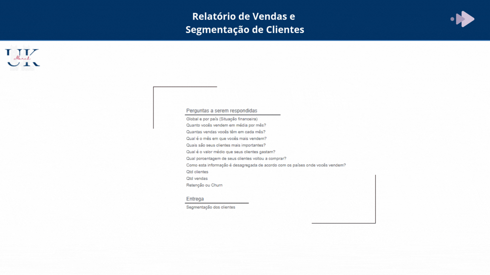
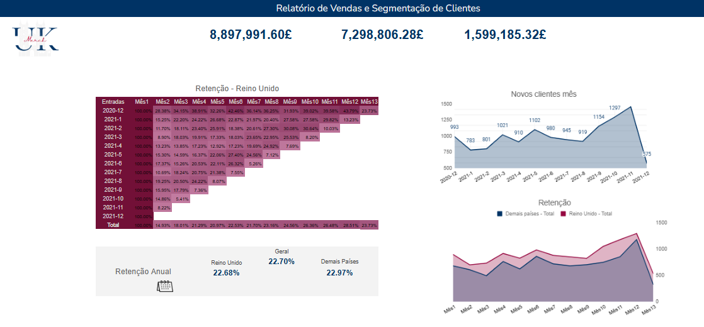
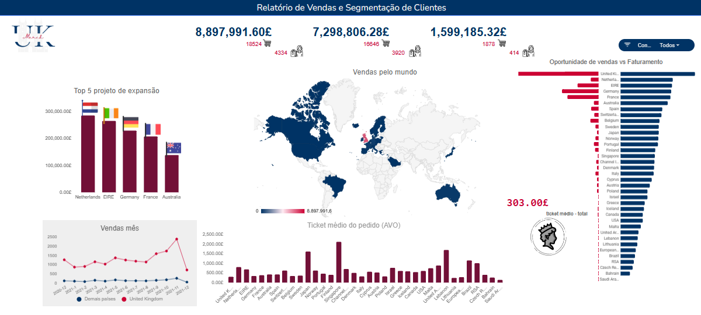
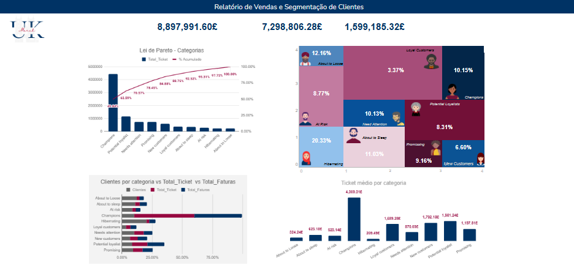
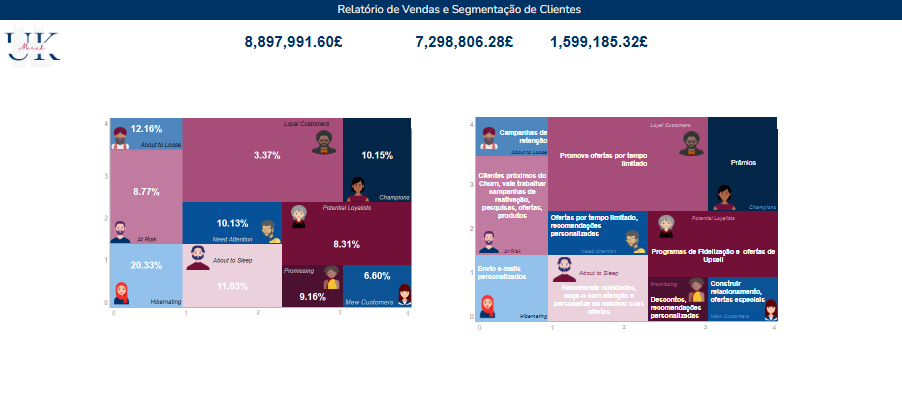

# sales-report-customer-segmentation
Relatório de Business Intelligence focado em análise de vendas globais e segmentação de clientes para suporte à decisão estratégica.

# 🛒 UK Merch: Inteligência de Vendas e Segmentação Estratégica (RFM)

## 📍 Índice de Navegação

1. [O Projeto](#o-projeto)
2. [Desafio e Perguntas de Negócio](#desafio)
3. [Metodologia e Ciclo de Desenvolvimento](#metodologia)
4. [Descrição das Variáveis do Dataset](#variaveis)
5. [Entregáveis](#entregaveis)
6. [Stack Tecnológica e Requisitos](#stack)
7. [Análise de Métricas de Vendas](#metricas)
8. [Diagnóstico de Faturamento e Retenção](#faturamento)
9. [Segmentação de Clientes usando RFM](#rfm)
10. [Recomendações a UK Merch](#recomendacoes)

---

##  📖 1. O Projeto
Análise exploratória e descritiva dos dados de vendas da **UK Merch**, uma empresa de varejo com operações globais. O objetivo central foi transformar um dataset bruto de transações em um **relatório executivo dinâmico** para suporte à decisão estratégica em marketing e logística.

### 🔗 Acesso Rápido ao Projeto

Para uma experiência completa, acesse os arquivos originais e a defesa técnica nos links abaixo:

* **[📊 Visualizar Dashboard Completo (Google Sheets)](https://docs.google.com/spreadsheets/d/1KjmgouYb5Y0Bz11SqnPDnXhB_3J-aeuu48cHFLPjhuQ/edit?usp=sharing)**
* **[🎥 Assistir Apresentação Técnica e Soft Skills (YouTube)](https://youtu.be/aYz9MBKIRTg)**

---

##  🎯 2. Desafio e Perguntas de Negócio
O dashboard foi projetado para solucionar dores reais da operação através de quatro pilares:

* **Performance Financeira:** Qual a média de vendas mensal e os meses de pico?
* **Concentração de Mercado:** Como as vendas se desagregram geograficamente?
* **Comportamento do Cliente:** Quem são os clientes *Top Tier* e qual o ticket médio?
* **Fidelização:** Qual a taxa de retenção anual vs. Churn?

---

##  🛠️ 3. Metodologia e Ciclo de Desenvolvimento
Projeto desenvolvido sob **metodologia ágil (Sprint de 6 dias)** em parceria com a **Laboratória e IBM**.

### 🔎 Etapas do Ciclo
1.  **Diagnóstico:** Importação da base global e exclusão de **7.429 registros inconsistentes**.
2.  **Tratamento:** Padronização de datas/moedas e criação de colunas de Recência, Frequência e Valor.
3.  **Análise Exploratória:** Identificação de sazonalidade e análise de faturamento por país.
4.  **Modelagem RFM:** Classificação da base em segmentos estratégicos.
5.  **Visualização:** Construção de dashboard interativo no Google Sheets com foco executivo.

---

##  📋 4. Descrição das Variáveis
| Variável | Descrição |
| :--- | :--- |
| **Nº da fatura** | ID exclusivo da transação (iniciado em "c" indica substituição). |
| **Data da fatura** | Timestamp da geração da transação. |
| **ID Cliente** | Identificador único de 5 dígitos por cliente. |
| **País** | Local de residência do cliente. |
| **Quantidade** | Volume de itens por transação. |
| **Valor** | Valor da fatura em Libras Esterlinas (£). |

---

##  📦 5. Entregáveis
* **Base Tratada:** Dados limpos e padronizados prontos para escala.
* **Modelagem de KPIs:** Faturamento, AOV (Ticket Médio) e Taxa de Retenção.
* **Dashboard Interativo:** Mapa global, ranking de países e indicadores de Pareto.
* **Segmentação RFM:** Base categorizada para campanhas de marketing direcionadas.
* **Vídeo de Apresentação:** Storytelling orientado a negócios com foco em decisões analíticas.

---

##  💻 6. Stack Tecnológica
* **Ferramenta Principal:** Google Sheets (Fórmulas Avançadas, QUERY, VLOOKUP).
* **Técnicas:** Limpeza de dados nulos, análise temporal e segmentação de clusters.

---

##  📊 7. Análise de Métricas de Vendas
A análise revelou um volume total de **18.524 compras** realizadas por **4.334 clientes**.

* **Domínio Geográfico:** O Reino Unido concentra 16.646 compras (aprox. 90% do volume transacional).
* **Top 5 Internacional:** Holanda, Irlanda, Alemanha, França e Austrália lideram a expansão.
* **Sazonalidade:** Pico histórico de vendas em **Novembro**, impulsionado por trocas de coleção e antecipação de feriados.

### 📊 Performance de Retenção e Aquisição (Reino Unido)

**Visão Geral e Desempenho Financeiro (2021)**

O dashboard centraliza os indicadores de sucesso da rede, destacando um faturamento global de **£ 8.897.000,00**. A distribuição da receita reforça a dominância do mercado britânico como o motor principal do negócio:

* **Concentração de Receita:** O Reino Unido gerou **£ 7.298.000,00** em vendas, enquanto as operações internacionais somaram **£ 1.599.000,00**.
* **Mapa de Calor de Retenção:** Demonstra a fidelidade da base de clientes ao longo de 12 meses, permitindo identificar com precisão os períodos de maior engajamento (*retention cohorts*).
* **Fluxo de Novos Clientes:** Detalha a aquisição mensal de usuários, servindo como um termômetro para a expansão da marca e eficácia das campanhas de marketing no mercado britânico.
* **Benchmark Internacional (UK vs. Global):** Compara a taxa de retenção do Reino Unido com as demais filiais. Os dados evidenciam que a operação no Reino Unido mantém uma performance **superior e consistente** em todos os meses do ano.

> **Nota Técnica:** Os valores financeiros foram convertidos para a moeda local da sede (Libras Esterlinas - £) para garantir a integridade da análise comparativa entre as filiais.

---

##  💰 8. Diagnóstico de Faturamento e Retenção
* **Faturamento Bruto:** **£ 8.897.991,60** (Global).
* **Distribuição:** Reino Unido (£ 7,29M) vs. Internacional (£ 1,59M).
* **Retenção Global:** **22,70%** (indicando forte padrão de recompra, mas com alta margem para otimização).
* **Destaque Estratégico:** **Singapura** apresenta ticket médio superior à média global de **£ 303**, indicando potencial de expansão premium.

### 📊 Análise Geográfica e Eficiência de Mercado

**Detalhamento da Performance Global e Oportunidades**

Esta seção do dashboard oferece uma visão estratégica sobre a capilaridade da rede e a eficiência de vendas em diferentes territórios:

* **Ranking de Expansão (Top 5):** À direita, o gráfico destaca as filiais com maior volume de vendas fora do Reino Unido: **Netherlands, EIRE, Germany, France e Australia**, ordenadas pelo desempenho financeiro.
* **Sazonalidade e Comparativo Mensal:** Abaixo do ranking, um gráfico de linhas detalha a evolução das vendas mês a mês, permitindo confrontar a estabilidade do Reino Unido frente à volatilidade das demais lojas.
* **Interatividade Geográfica:** O mapa-múndi central funciona como um filtro dinâmico (Drill-down), permitindo que os *stakeholders* visualizem métricas específicas ao selecionar qualquer país da rede.
* **Métricas de Ticket Médio (AOV):** Na base central, o gráfico de barras detalha o valor médio por pedido em cada nação. O **Ticket Médio Consolidado da rede é de £ 303.00**, um indicador vital para medir o valor de vida do cliente (*LTV*).
* **Análise de Oportunidades vs. Faturamento:** À esquerda, o gráfico de barras horizontais apresenta o comparativo de **Potencial de Vendas vs. Faturamento Real**, ferramenta essencial para identificar *gaps* de receita e mercados com alta demanda represada.

> **Insight de Negócio:** A disparidade visual no gráfico de barras horizontais revela em quais países a estratégia de conversão precisa de ajustes imediatos para transformar oportunidades em receita efetiva.

---

##  👥 9. Segmentação de Clientes (RFM)
Utilização do modelo de Recência, Frequência e Valor para categorizar a base:

* 🏆 **Campeões (10,15%):** Clientes de alta frequência e alto gasto.
* ❄️ **Hibernando (20,33%):** Parcela significativa da base com baixo engajamento recente.
* **Lei de Pareto:** Identificação da pequena parcela de clientes que gera a maior parte da receita líquida.

### 🧠 Inteligência de Segmentação e Análise de Pareto

**Detalhamento da Classificação de Clientes (Modelo RFM)**

Esta seção do dashboard aplica inteligência analítica para categorizar a base de clientes, permitindo estratégias de marketing personalizadas e diagnósticos precisos sobre a saúde da base:

* **Gráfico de Pareto (Impacto por Categoria):** Identifica a relevância de cada segmento no faturamento total. O gráfico destaca que os grupos **Champions** e **Loyal Customers** são os principais pilares de receita, permitindo priorizar esforços de retenção nestes perfis.
* **Volume de Clientes vs. Faturamento:** O gráfico de barras horizontais (inferior esquerdo) realiza um comparativo direto entre a quantidade de clientes, o total de faturamento e o volume de faturas por categoria. Note que a categoria **Champions** lidera em todas as métricas, validando sua alta frequência e valor.
* **Distribuição da Base de Clientes (Treemap):** Localizado no canto superior direito, este gráfico mostra a divisão percentual da base. É um indicador crítico para o negócio, revelando que **20,33%** dos clientes estão em estado de "Hibernating" (Hibernando) e **12,16%** estão "About to Sleep" (Prestes a perder), sinalizando uma oportunidade imediata para campanhas de reativação.
* **Ticket Médio por Categoria (AOV):** Na parte inferior direita, o gráfico de barras vertical detalha o valor médio gasto por transação. O destaque vai para os **Champions**, que possuem um Ticket Médio de **£ 4.309,31**, valor significativamente superior às demais categorias.

> **Insight Estratégico:** A análise revela que, embora a base tenha muitos clientes "hibernando", o alto ticket médio dos "Champions" sustenta a lucratividade. O foco da próxima fase deve ser a conversão de "Potential Loyalists" para o nível superior.

---

##  🚀 10. Recomendações Estratégicas

Com base na inteligência de dados extraída do modelo RFM e na análise de performance global, as seguintes diretrizes estratégicas foram estabelecidas:

1.  **Marketing Personalizado:** Abandonar comunicações globais e focar em programas VIP para "Campeões" e campanhas de reativação para clientes "Em Risco".
2.  **Expansão por Valor:** Priorizar mercados como Singapura para maximizar o ROI via Ticket Médio.
3.  **Foco em LTV:** Implementar automações de e-mail baseadas no ciclo de vida para reduzir o Churn.
4.  **Fidelização:** Criar incentivos específicos para o segmento "Potenciais Leais" visando transformá-los em "Campeões".

---
